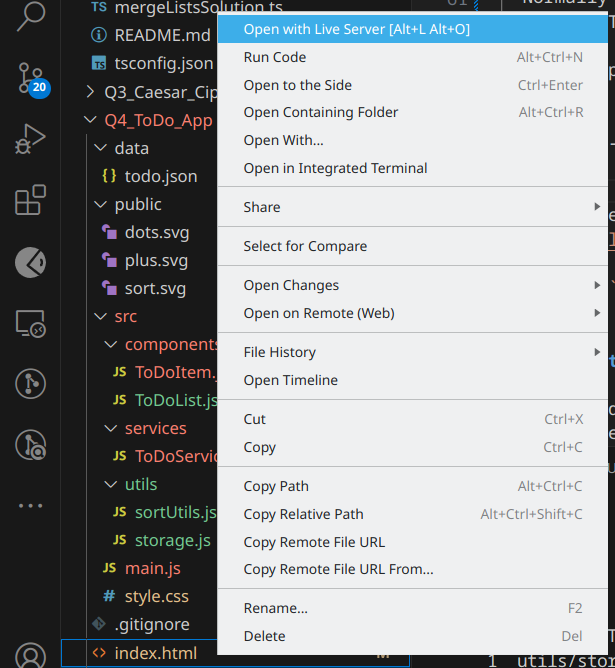

# Q4: To Do List Application

This is a Typescript based To Do List Application with the following features:

## Features

1. **Add, Edit, Delete Tasks**: Users can add new tasks, update existing tasks, or remove tasks.
2. **Task Completion**: Mark tasks as complete and move them to the "Done" list.
3. **Multiple Lists**: Tasks are separated into "To Do", "Doing", and "Done" lists.
4. **Sorting**: Tasks can be sorted by **Priority** and **End/Due Date**.
5. **No External Libraries**: The project is built using only vanilla **JavaScript** and Bootstrap. No JS library is used.

## File Structure

```
.
├── public       # Static assets
├── src
│   ├── style.css
│   ├── main.ts                  # Main entry point
│   ├── components
│   │   ├── ToDoItem.ts          # Component for single To-Do item
│   │   ├── ToDoList.ts          # Component for the entire list
│   ├── models
│   │   └── ToDoItemModel.ts     # TypeScript interface for Items
│   ├── services
│   │   └── ToDoService.ts       # Service for handling data operations
│   ├── utils
│       ├── storage.ts      # Utility functions for handling localStorage/JSON File
│       ├── sortUtils.ts
│
├── data
│   └── todo.json                 # Initial data for ToDo list (can be static for reading)
├── index.html
├── .gitignore                    # Git ignore file
├── package.json                  # NPM scripts and dependencies
├── README.md                     # Documentation
└── tsconfig.json                 # TypeScript configuration file

```

## Documentation to Run the Project

### 1. Requirements

To run the project, ensure you have a modern browser like **Google Chrome**, **Firefox**, or **Edge**. No additional server setup is required since this is a front-end project.

### 2. Running the Project

- **Step 1**: Clone the repository to your local machine: No need for this step if already done.

  ```bash
  git clone <repository-url>
  ```

- **Step 2**: Navigate into the project folder:
  ```bash
  cd Q4_To_Do_List
  ```
- **Step 3**: Start Development Server:
  Normally if HTML file is opened in browser, it will show a CORS error for js files used. To resolve this, a local server is needed. There are many ways to run this -

  1. Use python to start http server

     ```bash
     python3 -m http.server
     ```

     Enjoy the Application on port 8000 i.e on
     `http://localhost:8000/`

  2. Use `Live Server` VSCode Extension

     Just download the `Live Server` extension and right click on HTML file to choose option `Open with Live Server`.
     

## Build Steps

I previously used Vite as a build tool for running the Development server and producing builds. It is beneficial as it provides features like Hot Module Replacement, Build Optimizations, Static File Handling etc.

Here, Webpack can also be used for task automation like minification of CSS/JS files and live reloading.

A Preprocessor like Sass can also be used to improve CSS scalability.

I would also like to add Unit Tests using a testing framework like Jest to ensure the functionality remains intact during development.

These are the build steps I would follow for a more robust application.

## Scope for Improvements

I could have added more features like Drag & Drop to columns similar to Trello, calender to alert pending tasks etc. if time permitted. Due to ongoing Exams, I could only implement the necessary functions.

## Deployed Link

`chinmay-actual-assign.netlify.app/`
